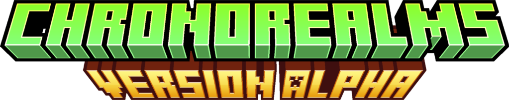

# Welcome to ChronoRealms Wiki

> __**ATTENTION!**__ This wiki is a work in progress. Many pages currently do not work or are very short and lacking of detail. These are the early stages of the server. We hope you understand. ❤️



## About ChronoRealms

Welcome to ChronoRealms, a unique Minecraft server that brings together the elements of survival, RPG, adventure, and open-world in a seamless and engaging experience. Dive into a world where exploration, collaboration, and creativity are at the forefront. What sets ChronoRealms apart is our commitment to providing a fair and enjoyable environment for all players, with absolutely no pay-to-win elements.

## Server Features

- **Survival RPG Experience:** Immerse yourself in a captivating survival experience with RPG elements that enhance gameplay and progression.
- **No Pay-to-Win:** At ChronoRealms, we believe in a level playing field. No pay-to-win features ensure that every player has an equal chance to thrive and succeed.
- **Community-driven Economy:** Build, trade, and thrive in a player-driven economy where collaboration and resourcefulness are key to success.
- **Unique Quests and Challenges:** Embark on epic quests and face challenging tasks that will test your skills and reward you with valuable treasures.
- **Custom Enchantments:** Discover and master unique enchantments that add depth to your equipment and offer strategic advantages.
- **Custom Plugins:** In our server, we have many plugins custom-made to fit our specific needs. This makes sure everyone has a unique and excellent experience.
- ***And more!***

## Getting Started

### Connect to ChronoRealms

To join our server, use the following IP address in your Minecraft client:

```
chronorealms.net
```

### Rules and Guidelines

Before you start your adventure, make sure to familiarize yourself with our server rules. We prioritize a friendly and respectful community, and adherence to these guidelines ensures a positive experience for everyone.

[Read the Rules](/rules)

## Community

Connect with other players, stay updated on server news, and engage with the ChronoRealms community on our official platforms:

- **Discord:** [Join our Discord server](https://go.chronorealms.net/discord)

## Support

If you encounter any issues or have questions, our support team is here to help. Reach out to us through one of the following channels:

- **Support Email:** contact@chronorealms.net
- **Discord Support:** https://go.chronorealms.net/discord

## Stay Connected

Follow us on social media for the latest updates, announcements, and behind-the-scenes content:

- [Twitter](https://twitter.com/ChronoRealmsMC)
- More socials soon!

## Help Contribute to the Wiki

The ChronoRealms Wiki is a community-driven resource, and we encourage players to contribute by adding information, guides, and tips. To get started, check out the [Wiki Contribution Guide](link_to_contribution_guide.md).

Thank you for being a part of the ChronoRealms community! We hope you have an amazing time exploring the vast realms of our Minecraft server.

Happy gaming!