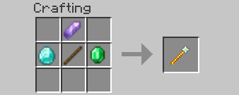

# Magic

> This article is a stub. You can [contribute](../contributing) to help make it better!

Magic is a wonderful feature we have on ChronoRealms. This feature is a bit complicated, but when used properly it can be quite the powerhouse. You will first need to craft a **wand**.

## The Wand

First thing you need to do to unlock the power of magic is **obtaining a magic wand**. The easiest, and only way of doing so is by crafting it. You will need 1 stick, 1 diamond, 1 emerald, and 1 amethyst shard.

After crafting the wand you should have access to one spell: Magic Missile. To get more spells or manage your wand you will need an enchantment table. You can now right-click your wand on the enchantment table to learn spells and more.

## Spell Points

In order to learn new spells, you will need **Spell Points** (SP). Spell Points can be obtained by using any spell. The spell must be interacting with someone or something to gain spell points.